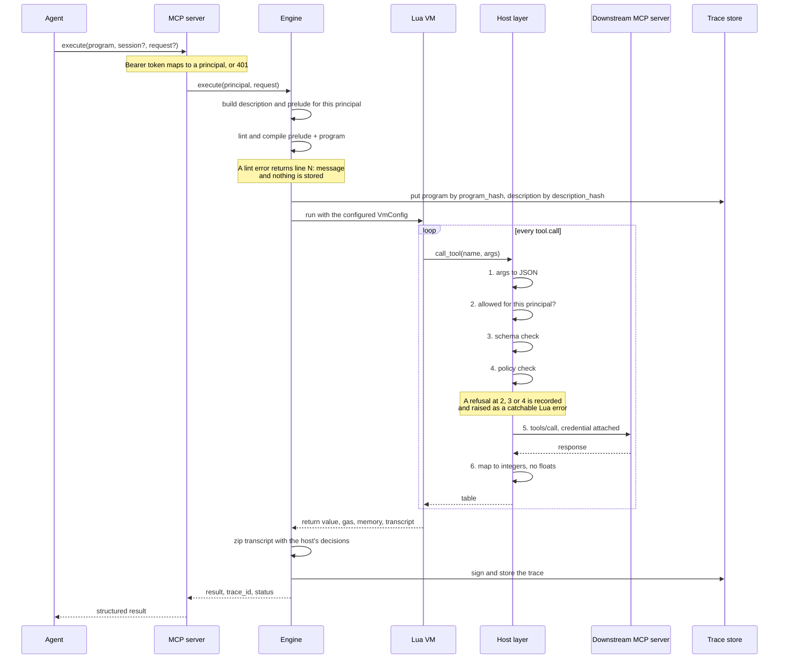
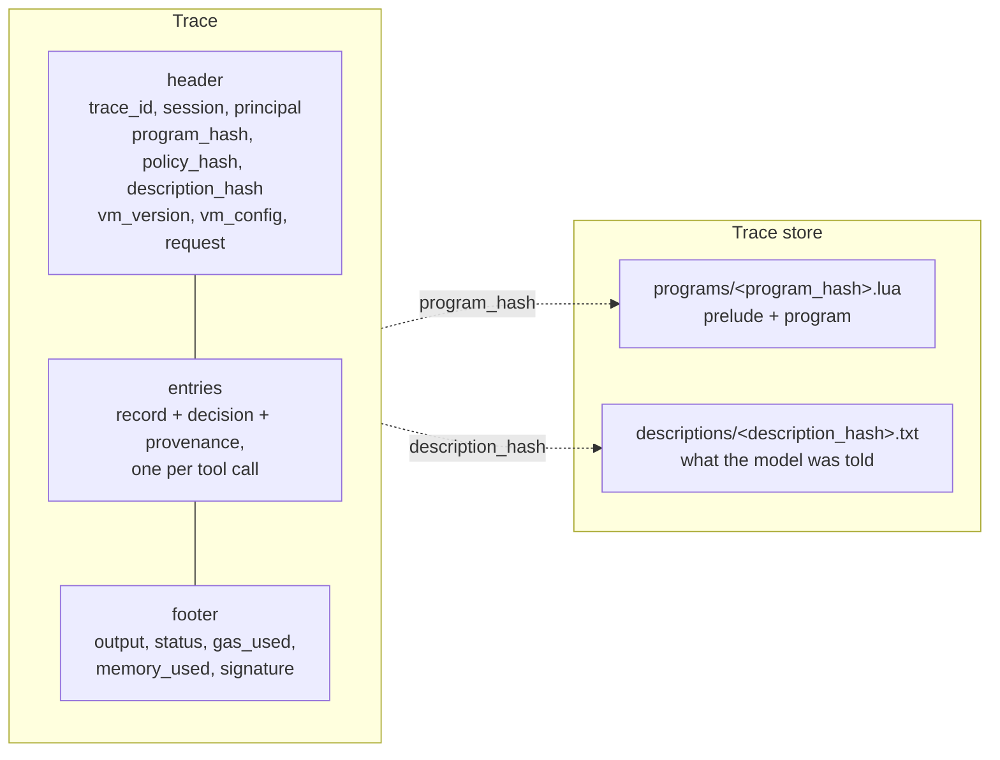
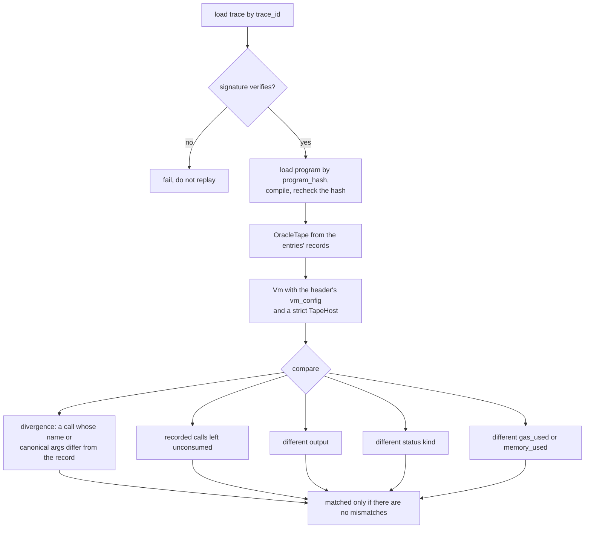

# proveno-gateway

An MCP gateway for [proveno](https://github.com/inertialabsxyz/proveno). Agents
submit Lua programs through one tool, `execute`. Every tool call a program makes
is policy-checked, has its credential injected by the gateway, is dispatched to
a downstream MCP server, and is recorded in a signed trace that replays
bit-for-bit with the network off.

The gateway makes no model calls: it receives programs, not tasks.

Depends on [proveno-core](https://github.com/inertialabsxyz/proveno-core) by git
tag.

```bash
make check
```

## How a run works

The agent's only tool is `execute`. Its description is the generated prompt: the
dialect rules, the typed API for the tools this principal may call, and example
programs. The program the model writes is compiled together with a generated
prelude, so `program_hash` covers both.



The credential is attached inside the gateway's MCP client, at the connection,
so the program and the model never see it. A run that fails still produces a
trace.

## Trace and replay

The trace wraps proveno-core's transcript: each entry is the record core made,
plus what the gateway knows and core does not.



`replay` rebuilds the run from that record alone, with no downstream connection.



Only the status kind is compared, not its message: `program_hash` deliberately
excludes line numbers, so a message's line can differ between two sources that
compile to the same bytecode.

## Demo

`demo/` runs the whole thing against a local Anvil chain: an agent rebalances a
wallet, the run replays with everything stopped, and a policy change is enforced
at the call. See [demo/README.md](demo/README.md).

## Status

Complete through milestone 4 of the spec: MCP edges, host layer, replay and the
demo. Provenance is bind-only and always `unsigned` in this prototype, and no
proof is generated. The spec is `planning/proveno-gateway-spec.md` in the
umbrella repository.

## Licence

See [LICENSE](LICENSE).
