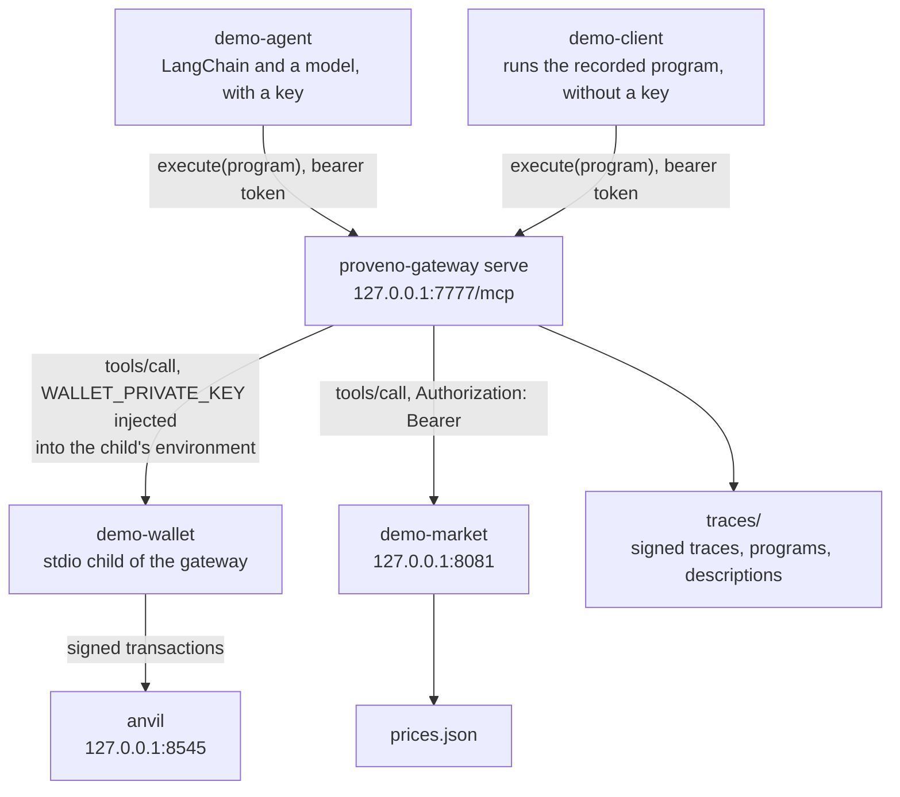
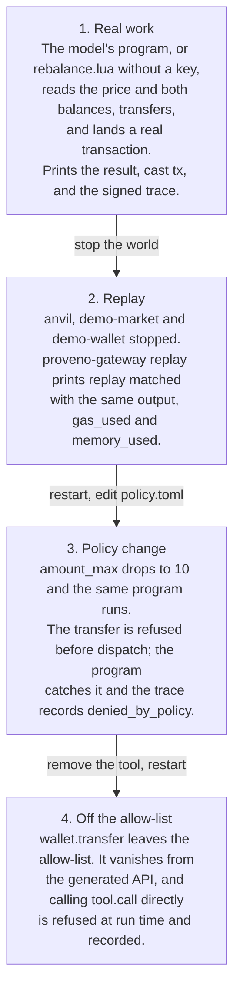

# The proveno-gateway pilot demo

This is the demo of spec section 5: an agent rebalances a wallet through the
gateway, the run replays with the world switched off, and a policy change is
enforced at the call.

With a model API key in the environment, step 1 is a LangChain agent: a model
reads the gateway's generated `execute` description and writes its own program.
Without one, step 1 runs `rebalance.lua`, a program an agent wrote earlier, and
the whole demo runs offline.

It runs entirely on localhost against a throwaway Anvil chain. The transactions
are real signed transactions; the chain is not.

## What the script starts



The gateway is the only process that holds a tool credential. It spawns
`demo-wallet` with an environment cleared down to `PATH`, `HOME` and
`WALLET_PRIVATE_KEY`, so the key never reaches the program or the model. The
model API key is the other way round: only `demo-agent` holds it, and the
gateway never sees it.

## The four steps



Steps 1 and 2 are the two halves of the claim: the agent did real work, and the
record reproduces it exactly. Steps 3 and 4 are the control: the policy decides
at the call, and the refusal is in the record either way.

## Prerequisites

- A Rust toolchain (`cargo`).
- [Foundry](https://getfoundry.sh): `anvil` and `cast` on `PATH`.
- `jq`.
- For the agent only: [uv](https://docs.astral.sh/uv/) and a model API key.
  Without a key, uv is not needed and nothing leaves localhost.

Ports 8545 (Anvil), 8081 (the price server) and 7777 (the gateway) must be free.

## Run it

```bash
# No key: step 1 runs the recorded program, rebalance.lua
./demo/run.sh

# Anthropic: a model writes step 1's program
export ANTHROPIC_API_KEY=...        # set in your shell, never as an argument
./demo/run.sh

# OpenRouter, or any OpenAI-compatible endpoint, for example an open model
export OPENROUTER_API_KEY=...
DEMO_AGENT_API=openai DEMO_AGENT_MODEL=qwen/qwen3-coder ./demo/run.sh
```

One command. It builds the gateway and the three demo binaries, starts
everything, runs the four steps, and stops every process it started. It takes a
few minutes on a cold build and a few seconds afterwards, plus the model's time
with a key. On its first keyed run `uv` fetches the agent's pinned dependencies.

Step 1 says which path it took: `Step 1 path: ANTHROPIC_API_KEY is set, so a
live model writes the program`, or `Step 1 path: ANTHROPIC_API_KEY is empty or
unset, so no model runs; using the recorded program rebalance.lua`.

The model is configuration, as in `conformance/`, never a code change:

| Variable | Meaning | Default |
|---|---|---|
| `DEMO_AGENT_API` | `anthropic` (Messages API), or `openai` (chat completions, as OpenRouter and most open-model hosts serve them) | `anthropic` |
| `DEMO_AGENT_MODEL` | The model id, as the endpoint names it | `claude-opus-5` for `anthropic`; required for `openai` |
| `DEMO_AGENT_BASE_URL` | The endpoint | Anthropic's API, or `https://openrouter.ai/api/v1` |
| `DEMO_AGENT_API_KEY_VAR` | The name of the variable holding the key | `ANTHROPIC_API_KEY`, or `OPENROUTER_API_KEY` |

A local endpoint is the same switch, with `LOCAL_KEY` exported and non-empty:

```bash
DEMO_AGENT_API=openai DEMO_AGENT_BASE_URL=http://localhost:11434/v1 \
    DEMO_AGENT_API_KEY_VAR=LOCAL_KEY DEMO_AGENT_MODEL=qwen3:32b ./demo/run.sh
```

## The agent

`agent/` is `demo-agent`, a small Python project managed with uv, separate from
every Cargo workspace. It uses LangChain's chat model interface and
`langchain-mcp-adapters`, with the gateway as its only MCP server, so it is the
kind of agent stack a team already runs, pointed at the gateway unchanged.

```bash
cd demo/agent
DEMO_AGENT_TOKEN=... uv run demo-agent "rebalance to 60/40 if the price has moved more than 2%"
```

It connects to `http://127.0.0.1:7777/mcp` (`--url`) with the bearer token from
`DEMO_AGENT_TOKEN`, loads `execute` and `check`, and gives the model a short
system prompt and the task. Everything about the dialect and the tool API comes
from `execute`'s generated description. It prints, in order, each program the
model passes to `execute`, the gateway's answer, and the `trace_id`. The task
itself is recorded in the trace as the `request`.

What happens after `execute` is decided by the agent's code, from the raw MCP
result, not left to the model:

- **A lint error** is a tool error with the text `line N: message` and no
  structured result. Nothing ran, so the error goes back to the model and it
  tries again, up to three attempts.
- **A failed run** is a tool error that carries a structured result with a
  `trace_id`: the program started, and its text says its tool calls have
  already happened. The agent prints it and stops. It never retries a failed
  run, because a second run could transfer twice.
- **A successful run** ends the loop; `--result-file` writes its result for
  `run.sh`.

Any other error is treated like a failed run. The flags `--api`, `--model`,
`--base-url` and `--api-key-var` match `conformance/` and default to the
`DEMO_AGENT_*` variables above.

**The model's program varies from run to run.** Two runs of the same model can
write different programs, name the result's fields differently, or need a
different number of lint round trips. That is why only step 1 uses the model.
Step 2 replays step 1's recorded trace, which reproduces the run exactly
whichever program it was, and step 3 runs `rebalance.lua` so the refusal it shows
is the same on every run. `run.sh` reads the transfer from the trace rather
than from the program's result, because the model chooses the result's shape.

Its own lint and tests, not part of the gateway's `make check`:

```bash
(cd demo/agent && make check)   # ruff, then builds the binaries and runs pytest
```

The tests do not call a model. They drive the agent with a scripted LangChain
fake chat model against a real gateway, Anvil and `demo-market` on free ports:
a lint error fed back and a corrected program that transfers, a failed run that
is not retried, three lint errors and a stop, and the negotiated MCP protocol.

## What each step proves

The prototype has to show three things (spec section 1): an agent can do real
work this way, a run can be reproduced exactly from its record, and a policy
change is enforced at the call with the refusal in the record.

**Step 1: an agent can do real work.** The task is "rebalance to 60/40 if the
price has moved more than 2%". With a key, the model writes the program and the
step shows it, each lint round trip, the result and the `trace_id`; what the
program does is the model's. Without a key, `rebalance.lua` runs: it reads the
ETH/USD price and the two balances, works out that the price moved 203 basis points and that the hot
wallet is 20 milli-ETH over its 60% target, and transfers 20 milli-ETH to the
vault. The step prints the generated `wallet.transfer` signature from the tool
description the model was given, the program's result, the transaction as `cast
tx` sees it, and the signed trace: header, every call with its policy decision
and provenance tag, and a footer with the output, gas and memory. It then lists
each call's decision and tag: the wallet's calls are
`onchain(eip155:31337, block, reference)`, with the block hash for a balance read
and the transaction hash for the transfer, and the price read is `unsigned`,
because `demo-market` reports nothing. The tag is `demo-wallet`'s own claim,
bound into the signed trace; the gateway does not check it against the chain.

**Step 2: a run can be reproduced exactly from its record.** The chain, the
price server and the wallet server are stopped, and `proveno-gateway replay`
runs the program again from the trace alone. It prints `replay matched`, the
same output, the same `gas_used` and the same `memory_used`, with no network
access at all.

**Step 3: a policy change is enforced at the call.** `policy.toml` drops to
`amount_max = 10` and `rebalance.lua` runs again on a fresh chain. With a key,
this is not the model's program but the recorded one, so the step shows the
same refusal on every run. The transfer
is refused before it is dispatched, so nothing reaches the chain. The program
catches the error with `pcall` and reports `action = "refused"`, and the trace
records the call with `denied_by_policy` and the reason.

**Step 4: the refusal holds for the primitive too.** `wallet.transfer` comes off
the allow-list entirely. It disappears from the generated tool API, so a model
reading the description never sees it. `direct_transfer.lua` calls it through
the `tool.call` primitive anyway, and the policy refuses it at run time, in the
trace.

## What is in here

| File | What it is |
|---|---|
| `wallet/` | `demo-wallet`, a stdio MCP server that signs real transactions with `alloy` and reports `onchain` provenance |
| `market/` | `demo-market`, an http MCP server serving prices from `prices.json` |
| `agent/` | `demo-agent`, a LangChain agent: a model writes step 1's program when there is a key |
| `client/` | `demo-client`, a tiny MCP client that runs a given program; step 1 without a key, and steps 3 and 4 |
| `gateway.toml` | The gateway config: two downstreams, the policy file, the trace store |
| `policy.toml` | The allow-list and `amount_max`; `run.sh` edits and restores it |
| `prices.json` | The price fixture, so every run sees the same market |
| `rebalance.lua` | A program an agent wrote earlier: step 1 without a key, and step 3 |
| `direct_transfer.lua` | Step 4's program, calling the tool through the primitive |
| `run.sh` | The four steps |
| `conformance/` | A harness measuring whether a model writes a correct program from the description alone; costs money, not in `make check` |

`demo/` is a Cargo workspace of its own, so the gateway's `make check` does not
build it. Build it with `(cd demo && cargo build --workspace)`.

Amounts are integers in milli-ETH, because the VM has integers and no floats.
Prices are decimals in the fixture and reach the program as decimal strings, so
`rebalance.lua` parses them into integer hundredths with `decimal.parse` and
computes the move in basis points.

## Secrets

Every secret in `gateway.toml` is an `env:NAME` reference, so no credential is
in this repository.

- The signing key, the agent's bearer token and the market key are generated
  fresh by `run.sh` on each run. A trace is signed with the key of the run that
  produced it, so `run.sh` starts from an empty `traces/` directory; traces from
  an earlier run will not verify against a later run's key.
- The wallet's private key is Anvil's first test account,
  `0xac0974bec39a17e36ba4a6b4d238ff944bacb478cbed5efcae784d7bf4f2ff80`, which is
  published in Anvil's own documentation and holds nothing outside a local test
  chain. No real key is ever involved.

`run.sh` sets that key only on the gateway process, as the `wallet` downstream's
`credential`. The gateway spawns `demo-wallet` with an environment cleared down
to `PATH`, `HOME` and `WALLET_PRIVATE_KEY`. The key is never a command line
argument, never in a config file, and never visible to the program or the model.
That is why `demo-wallet` takes its chain endpoint as `--rpc-url`: it has no
other environment to read it from.

The model API key (`ANTHROPIC_API_KEY`, `OPENROUTER_API_KEY`, or the variable
`DEMO_AGENT_API_KEY_VAR` names) comes only from your environment. Export it in
your shell; do not put it on the `run.sh` or `demo-agent` command line, where
other processes can read it. `run.sh` un-exports it before starting anything,
so cargo, Anvil, `demo-market` and the gateway never have it in their
environment, and exports it again only inside the subshell that runs
`demo-agent`. `demo-agent` hands it to the chat model in memory and never prints
it or writes it to a file. The gateway could not use it anyway: it never calls a
model.

## Driving step 1 from a live agent

Step 1 needs no `demo-client`; any MCP client can do it. Start the world by
hand, with secrets you choose:

```bash
cd demo
export PROVENO_SIGNING_KEY=$(od -An -tx1 -N32 /dev/urandom | tr -d ' \n')
export DEMO_AGENT_TOKEN=demo-agent-token
export MARKET_KEY=market-key
export MARKET_TOKEN=$MARKET_KEY

anvil --port 8545 --silent &
cast rpc anvil_setBalance 0xf39Fd6e51aad88F6F4ce6aB8827279cffFb92266 \
    "$(cast to-hex 620000000000000000)" --rpc-url http://127.0.0.1:8545
cast rpc anvil_setBalance 0x70997970C51812dc3A010C7d01b50e0d17dc79C8 \
    "$(cast to-hex 380000000000000000)" --rpc-url http://127.0.0.1:8545
cast rpc anvil_mine --rpc-url http://127.0.0.1:8545

cargo build --workspace
./target/debug/demo-market --listen 127.0.0.1:8081 --fixture prices.json &

(cd .. && cargo build)
WALLET_PRIVATE_KEY=0xac0974bec39a17e36ba4a6b4d238ff944bacb478cbed5efcae784d7bf4f2ff80 \
    ../target/debug/proveno-gateway serve --config gateway.toml
```

Then point Claude Code at it:

```bash
claude mcp add --transport http proveno-gateway http://127.0.0.1:7777/mcp \
    --header "Authorization: Bearer $DEMO_AGENT_TOKEN"
```

Ask it to rebalance to 60/40 if the price has moved more than 2%. It will read
the dialect and the tool API from `execute`'s description, write its own
program, and run it. `proveno://lua-guide` is available as a resource and as a
prompt. Keep the gateway on localhost: the MCP server rejects requests addressed
to anything else.
